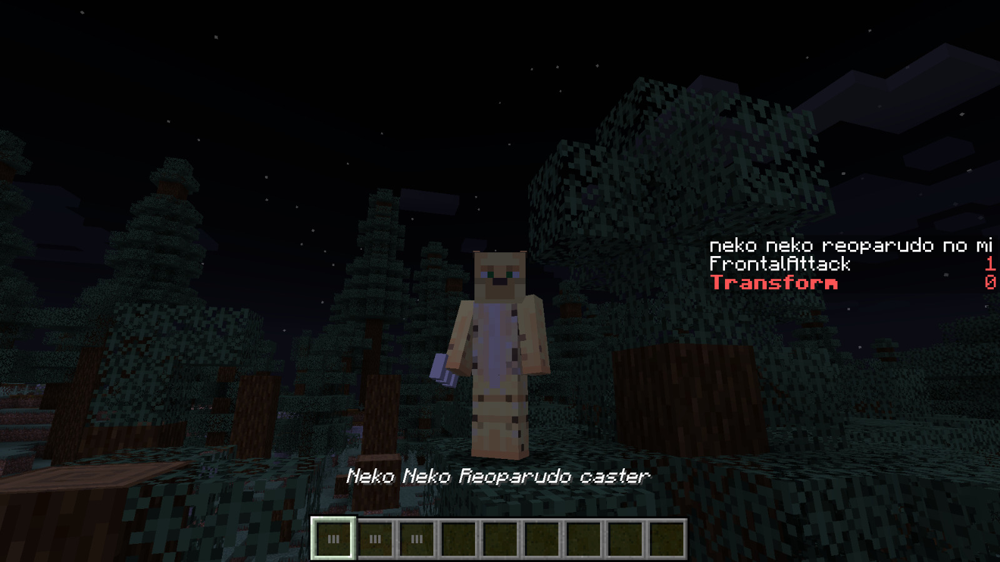
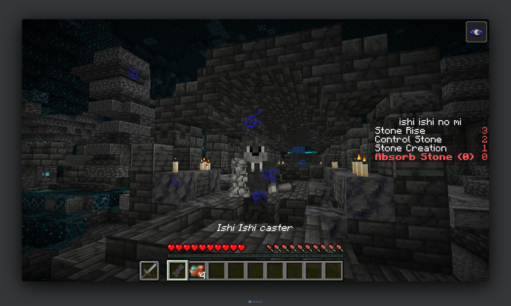

# HTTplugins -> OPhabs
## One Piece Plugin for Minecraft 1.19.2 (Spigot)

Welcome to the One Piece plugin repository for Minecraft 1.19.2 using Spigot! This plugin adds various features from the One Piece world to the game, including the famous Devil Fruits, Haki, and Rokushiki abilities.

## Features

### Devil Fruits
This plugin adds the following Devil Fruits to the game. Each grants unique abilities to the consumer:

- **Yami Yami no Mi (Dark-Dark Fruit)**
- **Mera Mera no Mi (Flame-Flame Fruit)**
- **Gura Gura no Mi (Tremor-Tremor Fruit)**
- **Moku Moku no Mi (Smoke-Smoke Fruit)**
- **Neko Neko no Mi (Model: Leopard)**
- **Magu Magu no Mi (Magma-Magma Fruit)**
- **Goro Goro no Mi (Rumble-Rumble Fruit)**
- **Ishi Ishi no Mi (Stone-Stone Fruit)**
- **Goru Goru no Mi (Gold-Gold Fruit)**
- **Inu Inu no Mi (Model: Wolf)**
- **Ryu Ryu no Mi (Model: Allosaurus)**
- **Ope Ope no Mi (Op-Op Fruit)**
- **Zushi Zushi no Mi (Gravity-Gravity Fruit)**
- **Suke Suke no Mi (Clear-Clear Fruit)**
- **Hie Hie no Mi (Ice-Ice Fruit)**

### Haki
Haki is a special ability that players can develop and improve. There are different types of Haki, each with its own leveling system:

- **Observation Haki**
- **Armament Haki**
- Coming soon: **Conqueror's Haki**

### Rokushiki
Rokushiki is a set of combat abilities that players can learn and improve over time. These abilities also have their own leveling system:

- **Shigan (Finger Pistol)**
- **Tobu Shigan (Flying Finger Pistol)**
- **Soru (Shave)**
- **Geppo (Moonwalk)**
- **Rankyaku (Storm Leg)**
- **Tekkai (Iron Body)**

## Commands

- `/oph giveFruit <fruit name> <player name>` - Gives a specific Devil Fruit to the player.
- `/oph removeFruit <player name>` - Removes a specific Devil Fruit from the player.
- `/oph toggleFastCasting` - Toggles the player's casting mode.
- `/oph giveHaki <player name>` - Gives Haki ability to a player.
- `/oph learnRokushiki <ability>` - Learns a Rokushiki ability.
- `/weaponShop` - Opens the custom weapon shop.

## Images

